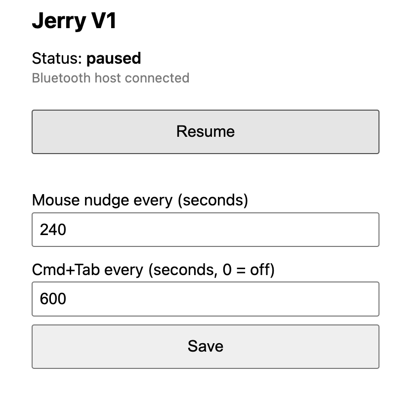

# FakeJerry 🐭

[](https://github.com/jesusareyesv/FakeJerry/actions/workflows/build.yml)
[](LICENSE)

> A mouse that never sleeps, so your laptop doesn't either.

Jerry is the mouse. This one is fake.

FakeJerry is firmware that turns a plain ESP32 dev board into a Bluetooth
mouse + keyboard whose only job is to keep a computer awake. Every few minutes
it nudges the pointer a few pixels and (optionally) presses Cmd+Tab. Nothing is
installed on the computer: it just sees a Bluetooth mouse and keyboard that
happen to belong to a very punctual, very boring user.

```
  you: away getting coffee ☕
  laptop: "still here?"
  FakeJerry: *wiggles 4 pixels*
  laptop: "ok cool"
```

**Why:** long-running jobs (builds, downloads, AI coding sessions) die when an
idle timer puts the laptop to sleep, and not every machine lets you install a
keep-awake app. A $5 board on a USB charger does.

## Hardware

- A classic ESP32 dev board (ESP32-WROOM-32 / "DevKit v1" style).
- A USB cable and any USB power source (laptop port, charger, power bank).

No extra components. The board's own **BOOT** button is the on/off switch and
the onboard LED shows the state.

> ESP32-S2 boards have no Bluetooth and will not work. Other variants (S3, C3)
> need a different `board` in `platformio.ini` and possibly different pins in
> `include/config.h`.

## Flash it

1. Install [PlatformIO](https://platformio.org/install/cli) (`brew install platformio` on macOS).
2. Optional, for the web page on your own network:
   `cp include/secrets.example.h include/secrets.h` and fill in your WiFi.
3. Plug the board in and run:

   ```sh
   pio run -t upload
   pio device monitor   # optional: see logs, including the board's IP address
   ```

   If the upload hangs at "Connecting...", hold the BOOT button until it starts.

## Pair it

Open Bluetooth settings on the computer and connect to **FakeJerry**. macOS may
open the Keyboard Setup Assistant; just close it. After the first pairing the
board reconnects by itself whenever it is powered.

## Use it

| LED        | Meaning                                  |
| ---------- | ---------------------------------------- |
| Solid      | Active and connected                     |
| Slow blink | Active, waiting for a Bluetooth host     |
| Off        | Paused                                   |

- **BOOT button:** press to pause / resume.
- **Web page:** toggle it and change the intervals from a phone or browser.
  - With `secrets.h`: open `http://fakejerry.local` (or the IP printed on the serial monitor).
  - Without it, or if the network can't be joined: connect to the open WiFi
    network `FakeJerry` and open `http://192.168.4.1`.



*The web page, here with the device renamed to "Jerry V1".*

The paused/active state and the intervals survive a power cycle.

## Configuration

Runtime settings (web page): mouse interval, Cmd+Tab interval (0 turns it off).
Each interval is randomised by ±20 %.

To rename the device (Bluetooth name, access point name, `.local` hostname),
define `DEVICE_NAME`, `DEVICE_MANUFACTURER` or `MDNS_HOSTNAME` in
`include/secrets.h`; see [`include/secrets.example.h`](include/secrets.example.h).
After renaming, remove the old entry from the computer's Bluetooth list and
pair again, because the old name is cached.

Other compile-time settings live in [`include/config.h`](include/config.h): device
name, pins, default intervals, nudge distance.

## Project layout

```
include/config.h           pins, names, defaults
include/secrets.example.h  WiFi credentials template
src/main.cpp               setup/loop, button, LED
src/ble_hid.*              composite BLE keyboard + mouse (NimBLE)
src/jiggler.*              timers, mouse nudge, Cmd+Tab
src/settings.*             settings persisted in NVS
src/web_control.*          WiFi, mDNS, HTTP API and page
```

HTTP API: `GET /api/status`, `POST /api/toggle`,
`POST /api/config` (form fields `mouse`, `cmdtab`, in seconds).

## FAQ

**Does it need to be plugged into the computer it keeps awake?**
No. It only needs power. A phone charger across the room works fine.

**Will it type things into my documents?**
No. It only ever sends a tiny mouse movement and Cmd+Tab. It never types
characters or clicks.

**Why does it have a web page?**
Because walking over to press a button is how they get you.

**Why "Jerry"?**
The original was also a mouse that was very hard to stop.

## Troubleshooting

- **Doesn't show up in Bluetooth settings:** check the LED is blinking (not
  off = paused). Managed laptops can block pairing new Bluetooth devices.
- **Paired before, won't reconnect after reflashing:** remove FakeJerry from
  the computer's Bluetooth list and pair again.
- **Cmd+Tab is annoying:** set its interval to 0. The mouse nudge alone keeps
  the screen awake.
- **WiFi join fails with "network not found":** the ESP32 radio is 2.4 GHz
  only. The serial monitor lists the networks it can see; use one of those.
- **Page loads in Safari or with `curl` but not in Chrome on macOS:** allow the
  browser under System Settings > Privacy & Security > Local Network.
- **`fakejerry.local` doesn't resolve:** use the IP from the serial monitor.

## Notes

- The web page has no authentication. Anyone on the same network (or anyone
  joining the open fallback access point) can pause it or change intervals.
- Keeping a machine awake may go against your employer's security policy.
  Whether to use this on a managed device is your call and your responsibility.

## License

[MIT](LICENSE)
